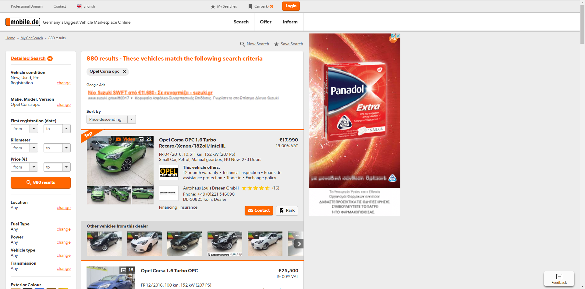
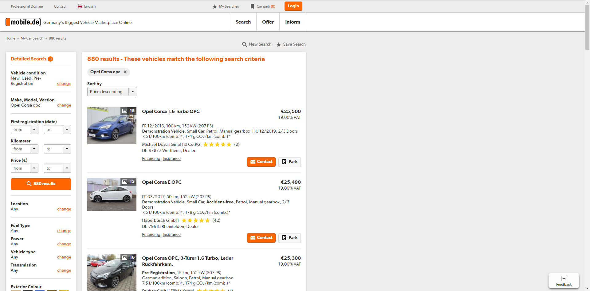
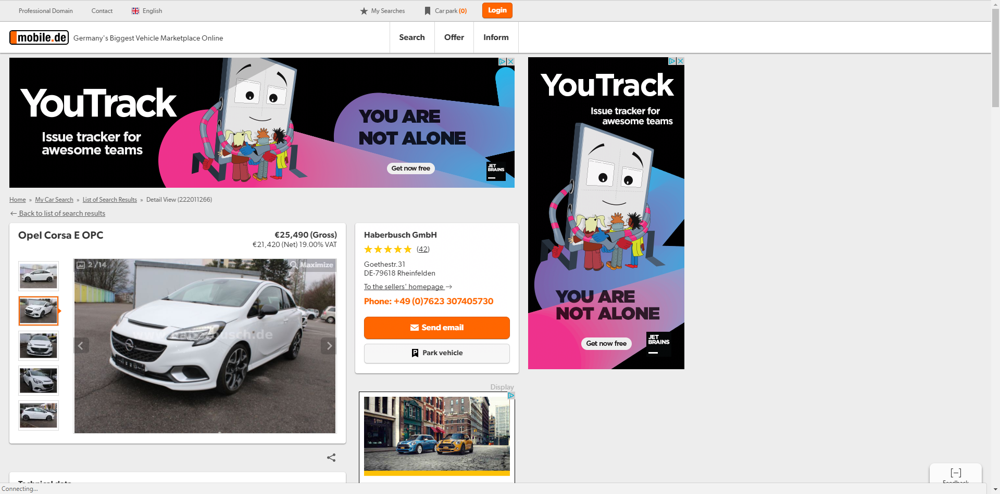
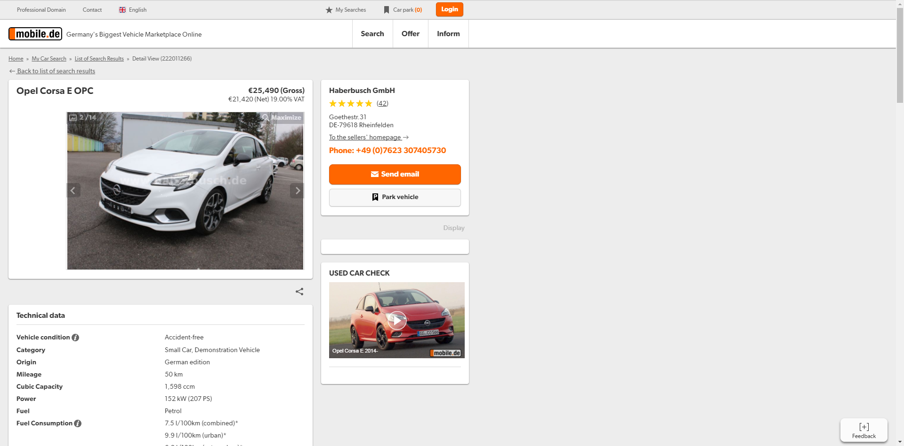

#Mobile.de NoSponsored Chrome Extension `1.0`

- hides top and promoted listings
- hides most of the ads if not all
- faster loading speeds and surfing

## Main Page before

## Main Page after

## Product Page before

## Product Page after

## Installation

1. **[Click here to download](https://github.com/aldiduzha/mobile.de-chrome-extension/archive/master.zip)**, unzip the file and save the folder on your computer.
2. Drag and drop it in Chrome’s `Settings > Extensions`.
3. Enjoy!

__Note:__ If you delete the folder with the extension on your computer it will also be removed from Chrome too.

## License

Licensed under [MIT](LICENSE) by [aldiduzha](http://aldiduzha.com).
